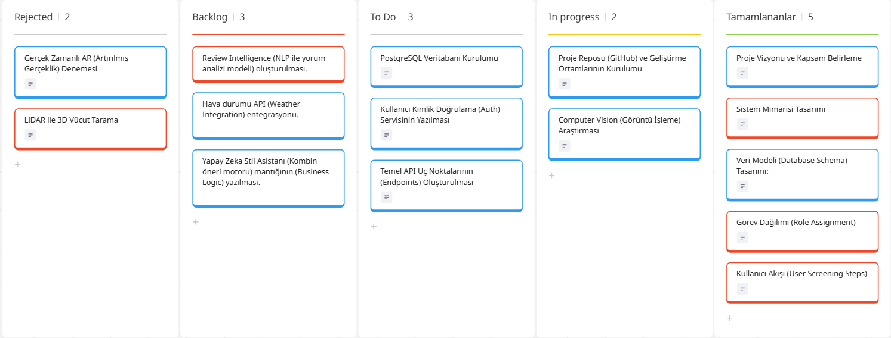
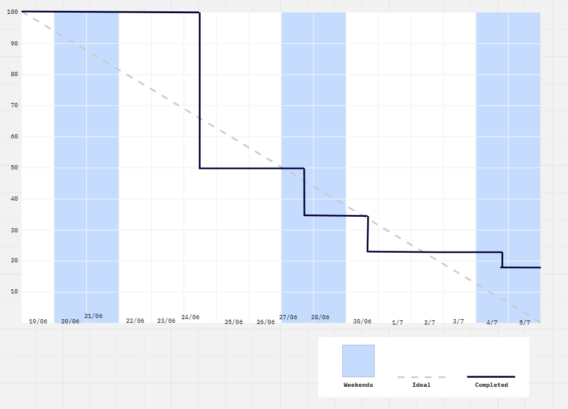
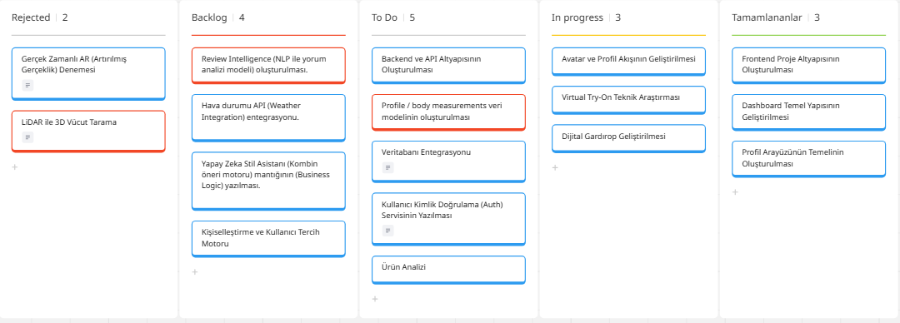
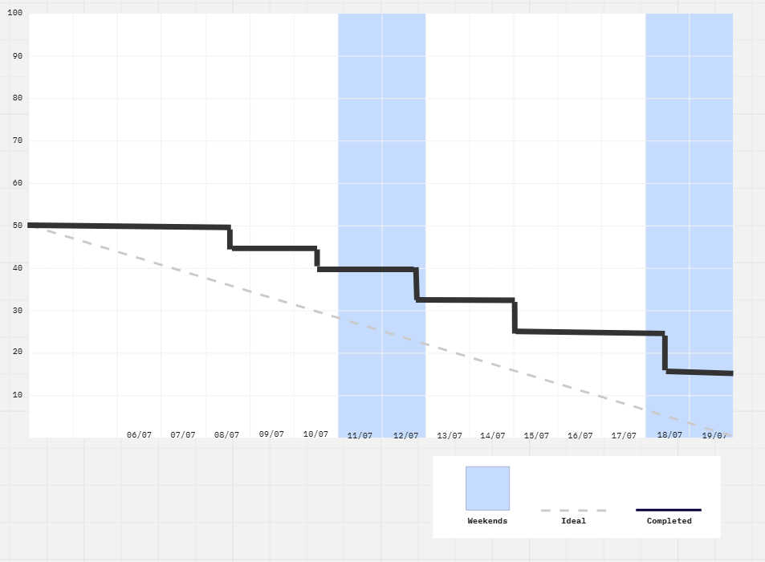

# **Takım İsmi**

Takım 12

# Ürün İle İlgili Bilgiler

## Takım Elemanları

- Zeynep Yazgan: Product Owner
- Tuana Coşgun: Scrum Master
- Sena Nur Solmaz: Team Member/Developer
- Muhammed Fatih Küçük: Team Member/Developer
- Onur Oduncu: Team Member/Developer

## Ürün İsmi

--MirrorAI--

## Ürün Açıklaması

- MirrorAI uygulamamız ile kullanıcıların internetten gördükleri kıyafetleri kendi dijital vücutları üzerinde deneyebilecekleri, dijital gardıroplarını oluşturabilecekleri ve yapay zekâdan günlük kombin önerileri alabilecekleri bir moda teknolojisi (Fashion Tech) platformu sunuyoruz. Sistem aynı zamanda kullanıcının gardırobunu öğrenerek, hava durumu ve etkinliklere göre kişiselleştirilmiş stil danışmanlığı yapmaktadır.

## Ürün Özellikleri

- Kullanıcı ölçülerine göre kişiselleştirilmiş gerçekçi 3D Dijital Avatar oluşturma
- E-ticaret linkleri üzerinden kıyafetleri analiz ederek AI Virtual Try-On (sanal deneme) sağlama
- Fotoğraf yükleyerek veya denenen ürünlerle Dijital Gardırop yönetimi
- NLP ile binlerce ürün yorumunu analiz ederek gerçek beden, kumaş kalitesi gibi Review Intelligence (Yorum Analizi) sunma
- Hava durumu ve etkinlik entegrasyonu ile AI Stil Asistanı ve Kombin Motoru

## Hedef Kitle

- Online alışveriş yapan kullanıcılar
- Moda ile ilgilenen kişiler ve stil danışmanlığı almak isteyenler
- Influencerlar ve içerik üreticileri
- Yoğun çalışan profesyoneller ve öğrenciler

## Product Backlog URL

[Miro Backlog Board](https://miro.com/app/board/uXjVH-wUJmI=/?share_link_id=981346227238)

---

# Sprint 1

- **Backlog düzeni ve Story seçimleri**: Bu sprintte tamamen ürünün fikirsel temellerinin atılmasına, sistem mimarisinin kurulmasına ve takım içi görev dağılımına odaklanılmıştır. Backlog, uygulamanın MVP'sine (V1) göre düzenlenmiş; "Avatar oluşturma", "Linkten ürün analizi" ve "Virtual Try-On" özellikleri için araştırma ve tasarım task'leri oluşturulmuştur. 

Story'ler yapılacak işlere (task'lere) bölünmüştür. Miro Board'da gözüken kırmızı item'lar yapılacak işleri (task) gösterirken, mavi item'lar story'leri temsil etmektedir.

- **Daily Scrum**: Daily Scrum toplantılarının zamansal sebeplerden ötürü Slack/Discord üzerinden yapılmasına karar verilmiştir.

- **Sprint board update**: Sprint board screenshotları: 
]
]

- **Ürün Durumu**: Proje henüz geliştirme (kodlama) aşamasına geçmemiştir. Şu an sistemin Yapay Zeka Mimarisi (Computer Vision, NLP bileşenleri), Veri Modeli tasarımları ve API Yapısı kağıt üzerinde tamamlanmış, teknik fizibilite yapılmıştır.

- **Sprint Review**: 
Alınan kararlar: Ekip içi iş bölümü netleştirilmiş ve uygulamanın temel özellikleri dökümante edilmiştir. Geliştirme ortamlarının (repo, veritabanı, kullanılacak kütüphaneler) kurulması bir sonraki sprint'in ilk işi olarak belirlenmiştir. Kodlama sürecine Sprint 2 itibariyle başlanacaktır.

- **Sprint Retrospective:**
  - Projenin vizyonu, sistem mimarisi ve çözülecek problem çok net bir şekilde tanımlandı. İş bölümü başarıyla yapıldı.
  - Ekip olarak ortak toplantı saati bulmakta ve senkronize çalışmakta ciddi zorluklar yaşandı, bu nedenle geliştirme sürecine başlanamadı.
  - Bir sonraki sprint için takım üyelerinin haftalık uygunluk takvimleri önceden çıkarılıp, fix toplantı saatleri (örneğin pazar akşamları vb.) netleştirilecek. İletişim kopukluklarını engellemek için iletişim kanalları daha aktif kullanılacak.

---

# Sprint 2

- **Sprint Notları**: 
Sprint 1 sonunda proje kapsamının netleştirilmesi ve teknik araştırmaların yapılmasının ardından Sprint 2'de somut geliştirme sürecine geçilmesi hedeflenmiştir.

Bu sprintte öncelik; uygulamanın frontend altyapısının kurulması, temel kullanıcı akışının oluşturulması, ana sayfa ve uygulama modüllerine ait ekranların geliştirilmesi ve Avatar, Virtual Try-On, Dijital Gardırop ve AI Stil Asistanı gibi temel özelliklerin uygulanabilirliğinin araştırılması olmuştur.

Sprint 2 sonunda React + Vite tabanlı frontend mimarisi oluşturulmuş; Home, Dashboard, Profile, Wardrobe, Try-On ve AI Stylist sayfalarının temel yapıları hazırlanmıştır. Routing ve ortak component yapısı oluşturulmuş, uygulamanın temel kullanıcı akışı frontend tarafında şekillendirilmiştir.

Backend, veritabanı ve gerçek AI model entegrasyonları ise henüz tamamlanmamış olup Sprint 3'te önceliklendirilecek geliştirmeler arasına alınmıştır.

- **Sprint içinde tamamlanması tahmin edilen puan**: 
Sprint 2 için toplam **50 story point** tamamlanması hedeflenmiştir.

Sprint başında belirlenen user story'ler; frontend geliştirme, kullanıcı profil yapısı, avatar oluşturma, dijital gardırop, ürün analizi, Virtual Try-On ve AI destekli kombin önerisi gibi temel MVP özelliklerini kapsamaktadır.

Sprint sonunda tamamlanamayan veya yalnızca araştırma/prototip seviyesinde kalan işler bir sonraki sprint backlog'una aktarılmıştır.

- **Puan tamamlama mantığı**: 
Story point tahminleri yapılırken görevlerin teknik zorluğu, geliştirme süresi, araştırma ihtiyacı ve diğer modüllere olan bağımlılıkları dikkate alınmıştır.

Frontend ekranlarının oluşturulması gibi kapsamı daha net olan işler daha düşük veya orta seviyede puanlanırken; Avatar oluşturma, Virtual Try-On ve AI tabanlı öneri sistemi gibi teknik araştırma ve model entegrasyonu gerektiren işler daha yüksek puanlarla değerlendirilmiştir.

Bir user story yalnızca ilgili kabul kriterlerinin tamamlanması durumunda tamamlanmış kabul edilmiştir. Frontend arayüzü oluşturulmuş ancak backend veya AI entegrasyonu tamamlanmamış özellikler "Devam Ediyor" veya "Araştırma Aşamasında" olarak değerlendirilmiştir.

  - **Backlog düzeni ve Story seçimleri**: 
Sprint 2 backlog’u, Sprint 1 sonunda belirlenen MVP hedeflerine göre yeniden düzenlenmiştir. İlk planlanan ürün kapsamı geniş olduğu için, bu sprintte öncelik son sprintte demo edilebilir bir ürün çıkarabilmeye yönelik temel işlere verilmiştir.

Story’ler yapılacak işlere/task’lere bölünmüştür. Backlog’da özellikle frontend geliştirme, kullanıcı profili, avatar yaklaşımı, dijital gardırop, ürün ekleme ve AI kombin önerisi başlıkları ayrı ayrı ele alınmıştır.

Sprint 2 için seçilen başlıca user story’ler:

| User Story | Açıklama | Öncelik | Tahmini Puan | Durum |
| --- | --- | --- | --- | --- |
| US-8 | Kullanıcı olarak uygulamanın ana sayfasını görerek ürünün amacını anlayabilmek istiyorum. | High | 5 | Devam Ediyor |
| US-9 | Kullanıcı olarak profil bilgilerimi girebileceğim bir form ekranı görmek istiyorum. | High | 5 | Planlandı |
| US-10 | Kullanıcı olarak vücut ölçülerimi girerek avatar oluşturma sürecini başlatmak istiyorum. | High | 8 | Araştırma Aşamasında |
| US-11 | Kullanıcı olarak gardırobuma kıyafet ekleyebilmek istiyorum. | High | 8 | Planlandı |
| US-12 | Kullanıcı olarak eklediğim kıyafetleri kategori bazlı görebilmek istiyorum. | Medium | 5 | Planlandı |
| US-13 | Kullanıcı olarak bir kıyafet görseli veya ürün linki ekleyebilmek istiyorum. | Medium | 8 | Araştırma Aşamasında |
| US-14 | Kullanıcı olarak yapay zekadan kombin önerisi alabilmek istiyorum. | Medium | 8 | Araştırma Aşamasında |
| US-15 | Takım olarak ürünün teknik mimarisini netleştirmek istiyoruz. | High | 3 | Devam Ediyor |

Sprint 2 için seçilen backlog item’ları:

| Backlog Item | Açıklama | Durum |
| --- | --- | --- |
| Frontend proje başlangıcı | Uygulamanın web arayüzü için temel proje yapısına başlanması | Devam Ediyor |
| Ana sayfa / landing page tasarımı | Kullanıcıya ürünün amacını anlatan ilk ekranın hazırlanması | Devam Ediyor |
| Dashboard yapısının planlanması | Kullanıcının avatar, gardırop ve kombin alanlarına ulaşacağı temel panelin tasarlanması | Planlandı |
| Profil formu alanlarının belirlenmesi | Boy, kilo, beden ve vücut ölçüsü alanlarının netleştirilmesi | Devam Ediyor |
| Avatar oluşturma yöntem araştırması | 3D avatar, placeholder avatar veya ölçülere dayalı temsil seçeneklerinin incelenmesi | Devam Ediyor |
| Gardırop veri yapısının belirlenmesi | Kıyafet adı, kategori, renk, görsel ve kaynak bilgisi gibi alanların çıkarılması | Devam Ediyor |
| Ürün linki / görsel analizi araştırması | Kullanıcının internetten ürün ekleyebilmesi için uygulanabilir yöntemlerin araştırılması | Devam Ediyor |
| AI kombin önerisi yaklaşımı | Kural tabanlı öneri, LLM destekli öneri veya hibrit yapı seçeneklerinin değerlendirilmesi | Devam Ediyor |

- **Daily Scrum**: 
Takım üyelerinin eğitim, iş ve kişisel programlarının farklı olması nedeniyle Daily Scrum iletişimi çevrim içi mesajlaşma ve düzenli ekip görüşmeleri üzerinden gerçekleştirilmiştir.

Daily Scrum sürecinde temel olarak şu konular takip edilmiştir:

- Bir önceki görüşmeden itibaren tamamlanan işler
- Üzerinde çalışılmakta olan görevler
- Bir sonraki adımda yapılacak işler
- Geliştirmeyi engelleyen teknik veya organizasyonel blocker'lar
- Takım üyeleri arasında yapılması gereken görev devirleri ve koordinasyon

Sprint ilerledikçe frontend geliştirme süreci, AI modellerinin araştırılması ve proje kapsamının MVP'ye uygun şekilde daraltılması ekip içerisinde değerlendirilmiştir.

- **Sprint board update**: Sprint board screenshotları: 
]
]

---

## Ürün Durumu

Sprint 2 sonunda uygulamanın React + Vite tabanlı frontend mimarisi oluşturulmuş ve temel kullanıcı akışı şekillendirilmiştir.

Aşağıdaki temel ekran ve modüllerin frontend yapıları hazırlanmıştır:

- Ana Sayfa / Landing Page
- Dashboard
- Kullanıcı Profili
- Dijital Gardırop
- Virtual Try-On
- AI Stil Asistanı

Dashboard üzerinden Avatar, Dijital Gardırop, AI Stil Asistanı ve Virtual Try-On gibi temel modüllere erişim sağlayacak navigasyon yapısı oluşturulmuştur.

Routing ve ortak component yapısının hazırlanmasıyla birlikte frontend daha modüler ve geliştirilebilir bir yapıya taşınmıştır.

Avatar, Virtual Try-On ve AI Stil Asistanı ekranlarının bulunması bu özelliklerin tamamen fonksiyonel olduğu anlamına gelmemektedir. Bu özelliklerin AI modeli, backend ve veri entegrasyonları henüz tamamlanmamış olup bazı bölümler araştırma veya placeholder aşamasındadır.

Sprint 3'te temel hedef; mevcut frontend'i backend ve veri altyapısıyla entegre ederek çalışır bir MVP kullanıcı akışı ortaya çıkarmaktır.

---

## Sprint Review

Sprint 2 sonunda gerçekleştirilen çalışmalar takım tarafından değerlendirilmiştir.

Sprint boyunca Sprint 1'e kıyasla geliştirme tarafında daha somut ilerleme sağlanmış ve uygulamanın frontend temel yapısı oluşturulmuştur. Ana sayfa, dashboard, profil, dijital gardırop ve diğer temel modüller için sayfa yapıları hazırlanarak uygulamanın kullanıcı akışı şekillendirilmeye başlanmıştır.

Sprint Review sonucunda aşağıdaki kararlar alınmıştır:

- Başlangıçta planlanan ürün kapsamının 6 haftalık Bootcamp süresi için oldukça geniş olduğu görülmüştür.
- Tüm özelliklerin eksiksiz geliştirilmesi yerine, kullanıcıya ürünün temel değer önerisini gösterebilecek çalışan bir MVP oluşturulmasına öncelik verilmesine karar verilmiştir.
- Avatar oluşturma, Virtual Try-On ve AI tabanlı kombin önerisi teknik açıdan en yüksek efor gerektiren özellikler olarak değerlendirilmiştir.
- Sprint 3'te backend, veritabanı ve frontend-backend entegrasyonunun öncelikli hale getirilmesine karar verilmiştir.
- AI tarafında tüm planlanan özellikleri aynı anda geliştirmek yerine, demo değerini ve kullanıcı deneyimini en fazla artıracak özelliklerin önceliklendirilmesi kararlaştırılmıştır.
- Tamamlanamayan user story ve task'ler Sprint 3 backlog'una aktarılmıştır.

---

# Sprint 3

---
