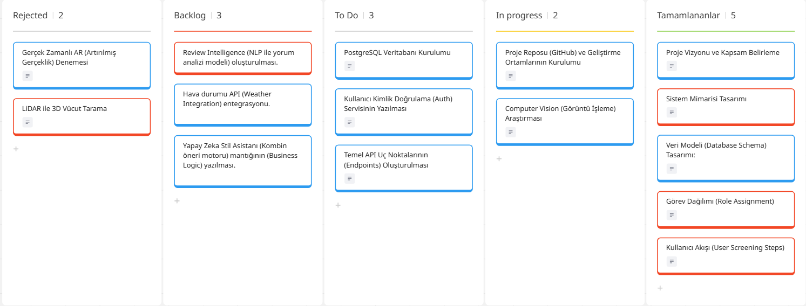
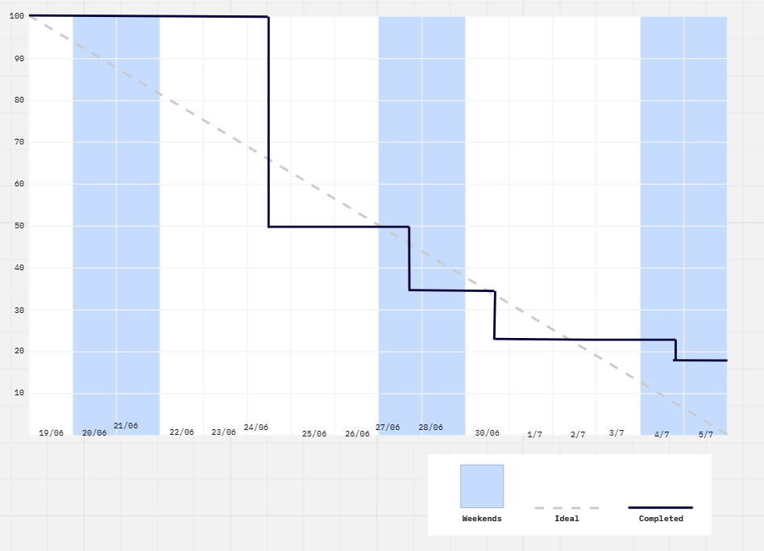
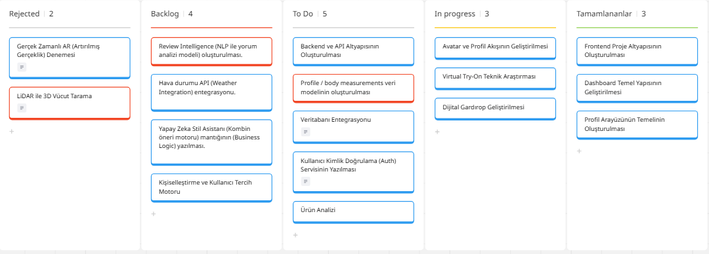
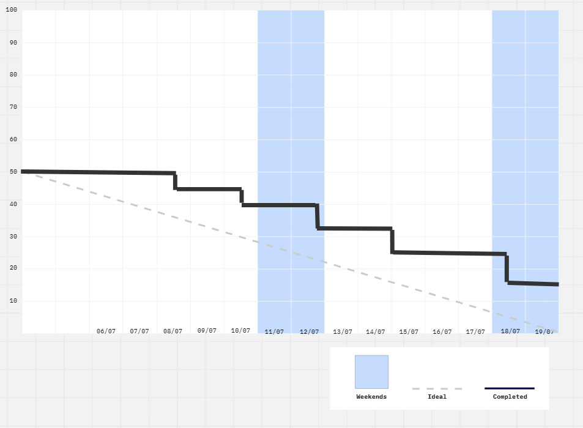

# **Takım İsmi**

Takım 12

# Ürün İle İlgili Bilgiler

## Takım Elemanları

- Zeynep Yazgan: Product Owner
- Tuana Coşgun: Scrum Master
- Sena Nur Solmaz: Team Member/Developer
- Muhammed Fatih Küçük: Team Member/Developer
- Onur Oduncu: Team Member/Developer

## Ürün İsmi

--MirrorAI--

## Ürün Açıklaması

- MirrorAI uygulamamız ile kullanıcıların internetten gördükleri kıyafetleri kendi dijital vücutları üzerinde deneyebilecekleri, dijital gardıroplarını oluşturabilecekleri ve yapay zekâdan günlük kombin önerileri alabilecekleri bir moda teknolojisi (Fashion Tech) platformu sunuyoruz. Sistem aynı zamanda kullanıcının gardırobunu öğrenerek, hava durumu ve etkinliklere göre kişiselleştirilmiş stil danışmanlığı yapmaktadır.

## Ürün Özellikleri

- Kullanıcı ölçülerine göre kişiselleştirilmiş gerçekçi 3D Dijital Avatar oluşturma
- E-ticaret linkleri üzerinden kıyafetleri analiz ederek AI Virtual Try-On (sanal deneme) sağlama
- Fotoğraf yükleyerek veya denenen ürünlerle Dijital Gardırop yönetimi
- NLP ile binlerce ürün yorumunu analiz ederek gerçek beden, kumaş kalitesi gibi Review Intelligence (Yorum Analizi) sunma
- Hava durumu ve etkinlik entegrasyonu ile AI Stil Asistanı ve Kombin Motoru

## Hedef Kitle

- Online alışveriş yapan kullanıcılar
- Moda ile ilgilenen kişiler ve stil danışmanlığı almak isteyenler
- Influencerlar ve içerik üreticileri
- Yoğun çalışan profesyoneller ve öğrenciler

## Product Backlog URL

[Miro Backlog Board](https://miro.com/app/board/uXjVH-wUJmI=/?share_link_id=981346227238)

---

# Sprint 1

- **Backlog düzeni ve Story seçimleri**: Bu sprintte tamamen ürünün fikirsel temellerinin atılmasına, sistem mimarisinin kurulmasına ve takım içi görev dağılımına odaklanılmıştır. Backlog, uygulamanın MVP'sine (V1) göre düzenlenmiş; "Avatar oluşturma", "Linkten ürün analizi" ve "Virtual Try-On" özellikleri için araştırma ve tasarım task'leri oluşturulmuştur. 

Story'ler yapılacak işlere (task'lere) bölünmüştür. Miro Board'da gözüken kırmızı item'lar yapılacak işleri (task) gösterirken, mavi item'lar story'leri temsil etmektedir.

- **Daily Scrum**: Daily Scrum toplantılarının zamansal sebeplerden ötürü Slack/Discord üzerinden yapılmasına karar verilmiştir.

- **Sprint board update**: Sprint board screenshotları: 
]
]


- **Ürün Durumu**: Proje henüz geliştirme (kodlama) aşamasına geçmemiştir. Şu an sistemin Yapay Zeka Mimarisi (Computer Vision, NLP bileşenleri), Veri Modeli tasarımları ve API Yapısı kağıt üzerinde tamamlanmış, teknik fizibilite yapılmıştır.

- **Sprint Review**: 
Alınan kararlar: Ekip içi iş bölümü netleştirilmiş ve uygulamanın temel özellikleri dökümante edilmiştir. Geliştirme ortamlarının (repo, veritabanı, kullanılacak kütüphaneler) kurulması bir sonraki sprint'in ilk işi olarak belirlenmiştir. Kodlama sürecine Sprint 2 itibariyle başlanacaktır.

- **Sprint Retrospective:**
  - Projenin vizyonu, sistem mimarisi ve çözülecek problem çok net bir şekilde tanımlandı. İş bölümü başarıyla yapıldı.
  - Ekip olarak ortak toplantı saati bulmakta ve senkronize çalışmakta ciddi zorluklar yaşandı, bu nedenle geliştirme sürecine başlanamadı.
  - Bir sonraki sprint için takım üyelerinin haftalık uygunluk takvimleri önceden çıkarılıp, fix toplantı saatleri (örneğin pazar akşamları vb.) netleştirilecek. İletişim kopukluklarını engellemek için iletişim kanalları daha aktif kullanılacak.

---

# Sprint 2

- **Sprint Notları**: 
Sprint 1 sonunda proje kapsamının netleştirilmesi ve teknik araştırmaların yapılmasının ardından Sprint 2'de somut geliştirme sürecine geçilmesi hedeflenmiştir.

Bu sprintte öncelik; uygulamanın frontend altyapısının kurulması, temel kullanıcı akışının oluşturulması, ana sayfa ve uygulama modüllerine ait ekranların geliştirilmesi ve Avatar, Virtual Try-On, Dijital Gardırop ve AI Stil Asistanı gibi temel özelliklerin uygulanabilirliğinin araştırılması olmuştur.

Sprint 2 sonunda React + Vite tabanlı frontend mimarisi oluşturulmuş; Home, Dashboard, Profile, Wardrobe, Try-On ve AI Stylist sayfalarının temel yapıları hazırlanmıştır. Routing ve ortak component yapısı oluşturulmuş, uygulamanın temel kullanıcı akışı frontend tarafında şekillendirilmiştir.

Backend, veritabanı ve gerçek AI model entegrasyonları ise henüz tamamlanmamış olup Sprint 3'te önceliklendirilecek geliştirmeler arasına alınmıştır.

- **Sprint içinde tamamlanması tahmin edilen puan**: 
Sprint 2 için toplam **50 story point** tamamlanması hedeflenmiştir.

Sprint başında belirlenen user story'ler; frontend geliştirme, kullanıcı profil yapısı, avatar oluşturma, dijital gardırop, ürün analizi, Virtual Try-On ve AI destekli kombin önerisi gibi temel MVP özelliklerini kapsamaktadır.

Sprint sonunda tamamlanamayan veya yalnızca araştırma/prototip seviyesinde kalan işler bir sonraki sprint backlog'una aktarılmıştır.

- **Puan tamamlama mantığı**: 
Story point tahminleri yapılırken görevlerin teknik zorluğu, geliştirme süresi, araştırma ihtiyacı ve diğer modüllere olan bağımlılıkları dikkate alınmıştır.

Frontend ekranlarının oluşturulması gibi kapsamı daha net olan işler daha düşük veya orta seviyede puanlanırken; Avatar oluşturma, Virtual Try-On ve AI tabanlı öneri sistemi gibi teknik araştırma ve model entegrasyonu gerektiren işler daha yüksek puanlarla değerlendirilmiştir.

Bir user story yalnızca ilgili kabul kriterlerinin tamamlanması durumunda tamamlanmış kabul edilmiştir. Frontend arayüzü oluşturulmuş ancak backend veya AI entegrasyonu tamamlanmamış özellikler "Devam Ediyor" veya "Araştırma Aşamasında" olarak değerlendirilmiştir.


  - **Backlog düzeni ve Story seçimleri**: 
Sprint 2 backlog’u, Sprint 1 sonunda belirlenen MVP hedeflerine göre yeniden düzenlenmiştir. İlk planlanan ürün kapsamı geniş olduğu için, bu sprintte öncelik son sprintte demo edilebilir bir ürün çıkarabilmeye yönelik temel işlere verilmiştir.

Story’ler yapılacak işlere/task’lere bölünmüştür. Backlog’da özellikle frontend geliştirme, kullanıcı profili, avatar yaklaşımı, dijital gardırop, ürün ekleme ve AI kombin önerisi başlıkları ayrı ayrı ele alınmıştır.

Sprint 2 için seçilen başlıca user story’ler:

| User Story | Açıklama | Öncelik | Tahmini Puan | Durum |
| --- | --- | --- | --- | --- |
| US-8 | Kullanıcı olarak uygulamanın ana sayfasını görerek ürünün amacını anlayabilmek istiyorum. | High | 5 | Devam Ediyor |
| US-9 | Kullanıcı olarak profil bilgilerimi girebileceğim bir form ekranı görmek istiyorum. | High | 5 | Planlandı |
| US-10 | Kullanıcı olarak vücut ölçülerimi girerek avatar oluşturma sürecini başlatmak istiyorum. | High | 8 | Araştırma Aşamasında |
| US-11 | Kullanıcı olarak gardırobuma kıyafet ekleyebilmek istiyorum. | High | 8 | Planlandı |
| US-12 | Kullanıcı olarak eklediğim kıyafetleri kategori bazlı görebilmek istiyorum. | Medium | 5 | Planlandı |
| US-13 | Kullanıcı olarak bir kıyafet görseli veya ürün linki ekleyebilmek istiyorum. | Medium | 8 | Araştırma Aşamasında |
| US-14 | Kullanıcı olarak yapay zekadan kombin önerisi alabilmek istiyorum. | Medium | 8 | Araştırma Aşamasında |
| US-15 | Takım olarak ürünün teknik mimarisini netleştirmek istiyoruz. | High | 3 | Devam Ediyor |

Sprint 2 için seçilen backlog item’ları:

| Backlog Item | Açıklama | Durum |
| --- | --- | --- |
| Frontend proje başlangıcı | Uygulamanın web arayüzü için temel proje yapısına başlanması | Devam Ediyor |
| Ana sayfa / landing page tasarımı | Kullanıcıya ürünün amacını anlatan ilk ekranın hazırlanması | Devam Ediyor |
| Dashboard yapısının planlanması | Kullanıcının avatar, gardırop ve kombin alanlarına ulaşacağı temel panelin tasarlanması | Planlandı |
| Profil formu alanlarının belirlenmesi | Boy, kilo, beden ve vücut ölçüsü alanlarının netleştirilmesi | Devam Ediyor |
| Avatar oluşturma yöntem araştırması | 3D avatar, placeholder avatar veya ölçülere dayalı temsil seçeneklerinin incelenmesi | Devam Ediyor |
| Gardırop veri yapısının belirlenmesi | Kıyafet adı, kategori, renk, görsel ve kaynak bilgisi gibi alanların çıkarılması | Devam Ediyor |
| Ürün linki / görsel analizi araştırması | Kullanıcının internetten ürün ekleyebilmesi için uygulanabilir yöntemlerin araştırılması | Devam Ediyor |
| AI kombin önerisi yaklaşımı | Kural tabanlı öneri, LLM destekli öneri veya hibrit yapı seçeneklerinin değerlendirilmesi | Devam Ediyor |

- **Daily Scrum**: 
Takım üyelerinin eğitim, iş ve kişisel programlarının farklı olması nedeniyle Daily Scrum iletişimi çevrim içi mesajlaşma ve düzenli ekip görüşmeleri üzerinden gerçekleştirilmiştir.

Daily Scrum sürecinde temel olarak şu konular takip edilmiştir:

- Bir önceki görüşmeden itibaren tamamlanan işler
- Üzerinde çalışılmakta olan görevler
- Bir sonraki adımda yapılacak işler
- Geliştirmeyi engelleyen teknik veya organizasyonel blocker'lar
- Takım üyeleri arasında yapılması gereken görev devirleri ve koordinasyon

Sprint ilerledikçe frontend geliştirme süreci, AI modellerinin araştırılması ve proje kapsamının MVP'ye uygun şekilde daraltılması ekip içerisinde değerlendirilmiştir.

- **Sprint board update**: Sprint board screenshotları: 
]
]

---

## Ürün Durumu

Sprint 2 sonunda uygulamanın React + Vite tabanlı frontend mimarisi oluşturulmuş ve temel kullanıcı akışı şekillendirilmiştir.

Aşağıdaki temel ekran ve modüllerin frontend yapıları hazırlanmıştır:

- Ana Sayfa / Landing Page
- Dashboard
- Kullanıcı Profili
- Dijital Gardırop
- Virtual Try-On
- AI Stil Asistanı

Dashboard üzerinden Avatar, Dijital Gardırop, AI Stil Asistanı ve Virtual Try-On gibi temel modüllere erişim sağlayacak navigasyon yapısı oluşturulmuştur.

Routing ve ortak component yapısının hazırlanmasıyla birlikte frontend daha modüler ve geliştirilebilir bir yapıya taşınmıştır.

Avatar, Virtual Try-On ve AI Stil Asistanı ekranlarının bulunması bu özelliklerin tamamen fonksiyonel olduğu anlamına gelmemektedir. Bu özelliklerin AI modeli, backend ve veri entegrasyonları henüz tamamlanmamış olup bazı bölümler araştırma veya placeholder aşamasındadır.

Sprint 3'te temel hedef; mevcut frontend'i backend ve veri altyapısıyla entegre ederek çalışır bir MVP kullanıcı akışı ortaya çıkarmaktır.

---

## Sprint Review

Sprint 2 sonunda gerçekleştirilen çalışmalar takım tarafından değerlendirilmiştir.

Sprint boyunca Sprint 1'e kıyasla geliştirme tarafında daha somut ilerleme sağlanmış ve uygulamanın frontend temel yapısı oluşturulmuştur. Ana sayfa, dashboard, profil, dijital gardırop ve diğer temel modüller için sayfa yapıları hazırlanarak uygulamanın kullanıcı akışı şekillendirilmeye başlanmıştır.

Sprint Review sonucunda aşağıdaki kararlar alınmıştır:

- Başlangıçta planlanan ürün kapsamının 6 haftalık Bootcamp süresi için oldukça geniş olduğu görülmüştür.
- Tüm özelliklerin eksiksiz geliştirilmesi yerine, kullanıcıya ürünün temel değer önerisini gösterebilecek çalışan bir MVP oluşturulmasına öncelik verilmesine karar verilmiştir.
- Avatar oluşturma, Virtual Try-On ve AI tabanlı kombin önerisi teknik açıdan en yüksek efor gerektiren özellikler olarak değerlendirilmiştir.
- Sprint 3'te backend, veritabanı ve frontend-backend entegrasyonunun öncelikli hale getirilmesine karar verilmiştir.
- AI tarafında tüm planlanan özellikleri aynı anda geliştirmek yerine, demo değerini ve kullanıcı deneyimini en fazla artıracak özelliklerin önceliklendirilmesi kararlaştırılmıştır.
- Tamamlanamayan user story ve task'ler Sprint 3 backlog'una aktarılmıştır.

---

# Sprint 3

---

## Sprint Notları

Sprint 2 sonunda gerçekleştirilen teknik değerlendirmeler sonucunda, başlangıçta planlanan 3D avatar oluşturma, Virtual Try-On, ürün linki analizi ve kapsamlı yapay zekâ entegrasyonlarının kalan Bootcamp süresi içerisinde çalışır bir MVP seviyesine getirilmesinin mümkün olmadığı görülmüştür.

Bu nedenle Sprint 3 başlangıcında ürün kapsamı yeniden değerlendirilmiş ve projenin temel kullanıcı değeri korunarak daha uygulanabilir bir MVP yapısına geçilmiştir.

Yeni MVP kapsamında kullanıcı:

- Dijital gardırobundaki bir kıyafeti ana parça olarak seçebilir.
- Gardırobunda bulunmayan bir kıyafetin görselini yükleyebilir.
- Kombin önerisi için etkinlik ve stil tercihi yapabilir.
- Seçtiği veya yüklediği parçaya uygun kombin önerisini görüntüleyebilir.

Sprint boyunca mevcut frontend ekranları bu yeni kullanıcı akışına göre güncellenmiştir.

---

## Sprint Hedefi

Sprint 3 sonunda kullanıcının dijital gardırobundaki bir parçayı seçebildiği veya dışarıdan alternatif bir kıyafet görseli yükleyebildiği, etkinlik ve stil tercihlerini belirleyebildiği ve bu girdiler doğrultusunda kombin önerisi görüntüleyebildiği demo edilebilir bir MVP kullanıcı akışı oluşturmak hedeflenmiştir.

---

## Sprint 3 Kapsam Değişikliği

Sprint 2 Review sürecinde, başlangıçta belirlenen ürün kapsamının mevcut ekip kapasitesi ve proje takvimi açısından oldukça geniş olduğu değerlendirilmiştir.

Özellikle aşağıdaki özelliklerin yüksek teknik bağımlılık ve geliştirme süresi gerektirdiği görülmüştür:

- Gerçekçi 3D avatar oluşturma
- Avatar üzerinde Virtual Try-On
- E-ticaret bağlantısından ürün bilgilerinin alınması
- Ürün yorumlarının analiz edilmesi
- Fotoğraftan otomatik vücut ölçüsü çıkarılması
- Gerçek zamanlı yapay zekâ tabanlı sanal deneme

Bu nedenle Sprint 3 başlangıcında MVP kapsamı yeniden önceliklendirilmiştir. Projenin dijital gardırop ve kombin önerisi değer önerisi korunmuş; avatar ve sanal deneme özellikleri mevcut MVP kapsamından çıkarılmıştır.

Yeni ürün akışı aşağıdaki şekilde belirlenmiştir:

1. Kullanıcı dijital gardırobundaki bir kıyafeti ana parça olarak seçebilir.
2. Alternatif olarak dışarıdan bir kıyafet görseli yükleyebilir.
3. Etkinlik ve stil tercihini belirleyebilir.
4. Seçilen veya yüklenen parçaya göre kombin önerisi görüntüleyebilir.

Bu kapsam değişikliği, son sprint içerisinde çalışır ve gösterilebilir bir kullanıcı deneyimi oluşturabilmek amacıyla yapılmıştır.

---

## Sprint İçinde Tamamlanması Tahmin Edilen Puan

Sprint 3 için toplam **50 story point** tamamlanması hedeflenmiştir.

Sprint puanları aşağıdaki geliştirme alanlarına dağıtılmıştır:

- Yeni MVP kapsamının belirlenmesi
- Dijital gardırop ekranının geliştirilmesi
- Gardıroptan ana parça seçme akışı
- Seçilen ürünün AI Stylist ekranına aktarılması
- Etkinlik ve stil tercihlerinin alınması
- Alternatif kıyafet görseli yükleme alanı
- Kombin sonucu gösterimi
- Backend ve veri entegrasyonu
- Test ve dokümantasyon

---

## Puan Tamamlama Mantığı

Story point tahminleri yapılırken görevlerin geliştirme süresi, teknik zorluğu, frontend ve backend bağımlılıkları, entegrasyon ihtiyacı ve test kapsamı dikkate alınmıştır.

Yalnızca arayüzü bulunan ancak gerçek veri, backend veya öneri sistemiyle entegre olmayan özellikler tamamen tamamlanmış kabul edilmemiştir. Bu tür işler aşağıdaki durum ifadeleriyle değerlendirilmiştir:

- Frontend tamamlandı
- Frontend prototipi tamamlandı
- Mock veri ile tamamlandı
- Devam ediyor
- Backend bekleniyor
- Planlandı

Bir user story'nin tamamlanmış sayılması için ilgili kabul kriterlerinin kullanıcı akışı içerisinde doğrulanabilir olması esas alınmıştır.

---

## Backlog Düzeni ve Story Seçimleri

Sprint 3 backlog'u, Sprint 2 Review sonucunda alınan kapsam daraltma kararına göre yeniden düzenlenmiştir.

Avatar, Virtual Try-On, ürün yorum analizi ve e-ticaret bağlantısından ürün çıkarımı gibi yüksek maliyetli işler Sprint 3 MVP kapsamından çıkarılmıştır.

Backlog önceliği aşağıdaki kullanıcı akışına verilmiştir:

- Dijital gardırobu görüntüleme
- Gardıroba yeni kıyafet ekleme
- Gardıroptan kıyafet kaldırma
- Gardıroptaki bir kıyafeti ana parça olarak seçme
- Seçilen ürünü AI Stylist ekranına aktarma
- Etkinlik ve stil tercihi alma
- Alternatif kıyafet görseli yükleme
- Kombin sonucunu kullanıcıya gösterme
- Backend ve veri entegrasyonu
- Test, hata düzeltme ve dokümantasyon

Miro Board üzerinde mavi kartlar user story'leri, kırmızı kartlar ise bu story'lere bağlı task'leri göstermektedir.

---

## Sprint 3 User Story Tablosu

| ID | User Story | Öncelik | Puan | Durum |
|---|---|---:|---:|---|
| US-301 | Kullanıcı olarak dijital gardırobumdaki kıyafetleri görmek istiyorum; böylece mevcut ürünlerim arasından seçim yapabilirim. | Yüksek | 5 | Frontend tamamlandı |
| US-302 | Kullanıcı olarak gardırobuma yeni kıyafet eklemek istiyorum; böylece kıyafetlerimi dijital ortamda yönetebilirim. | Yüksek | 5 | Frontend tamamlandı |
| US-303 | Kullanıcı olarak gardırobumdaki bir parçayı kombin için ana ürün olarak seçmek istiyorum; böylece sistem bu parçaya uygun ürünler önerebilir. | Yüksek | 5 | Tamamlandı |
| US-304 | Kullanıcı olarak seçtiğim ürünün bilgilerini kombin ekranında görmek istiyorum; böylece doğru parçayla işlem yaptığımı anlayabilirim. | Yüksek | 5 | Tamamlandı |
| US-305 | Kullanıcı olarak kombin önerisi için etkinlik ve stil tercihi yapmak istiyorum; böylece önerinin kullanım amacıma uygun olmasını sağlayabilirim. | Yüksek | 5 | Frontend tamamlandı |
| US-306 | Kullanıcı olarak gardırobumda bulunmayan bir kıyafetin görselini yüklemek istiyorum; böylece bu ürünü mevcut gardırobumdaki parçalarla kombinleyebilirim. | Yüksek | 5 | Frontend prototipi tamamlandı |
| US-307 | Kullanıcı olarak seçtiğim girdilere göre kombin önerisi görüntülemek istiyorum; böylece kıyafet seçme süremi azaltabilirim. | Yüksek | 8 | Mock sonuçla tamamlandı |
| US-308 | Kullanıcı olarak gardırop verilerimin kalıcı olarak saklanmasını istiyorum; böylece uygulamayı tekrar açtığımda ürünlerime ulaşabilirim. | Yüksek | 7 | Backend bekleniyor |
| US-309 | Kullanıcı olarak yüklediğim kıyafet görselinin analiz edilmesini istiyorum; böylece ürünün kategori ve renk bilgileri otomatik olarak belirlenebilir. | Orta | 5 | Planlandı |

**Toplam hedeflenen puan: 50 story point**

---

## Sprint 3 Backlog / Task Tablosu

| Task ID | Görev | Bağlı Story | Durum |
|---|---|---|---|
| T-301 | Gardırop için örnek ürün verilerinin hazırlanması | US-301 | Tamamlandı |
| T-302 | Ürün görsellerinin gardırop kartlarına eklenmesi | US-301 | Tamamlandı |
| T-303 | Gardıroba ürün ekleme arayüzünün hazırlanması | US-302 | Frontend tamamlandı |
| T-304 | Gardıroptan ürün kaldırma işlevinin hazırlanması | US-302 | Frontend tamamlandı |
| T-305 | Kıyafet kartlarına “Kombin Oluştur” butonunun eklenmesi | US-303 | Tamamlandı |
| T-306 | Seçilen ürünün AI Stylist ekranına aktarılması | US-304 | Tamamlandı |
| T-307 | Seçilen ürünün görsel, isim, kategori ve renk bilgilerinin gösterilmesi | US-304 | Tamamlandı |
| T-308 | Etkinlik seçim alanının eklenmesi | US-305 | Tamamlandı |
| T-309 | Stil seçim alanının eklenmesi | US-305 | Tamamlandı |
| T-310 | Alternatif ürün fotoğrafı için dosya yükleme alanının oluşturulması | US-306 | Frontend tamamlandı |
| T-311 | Seçilen dosya adının kullanıcıya gösterilmesi | US-306 | Tamamlandı |
| T-312 | Kombin oluşturma butonunun ve sonuç alanının hazırlanması | US-307 | Tamamlandı |
| T-313 | Örnek kombin verisinin frontend üzerinde gösterilmesi | US-307 | Mock veri ile tamamlandı |
| T-314 | Gardırop CRUD API'lerinin geliştirilmesi | US-308 | Backend bekleniyor |
| T-315 | Görsel yükleme endpoint'inin geliştirilmesi | US-306 | Backend bekleniyor |
| T-316 | Kombin önerisi endpoint'inin geliştirilmesi | US-307 | Backend bekleniyor |
| T-317 | Frontend-backend entegrasyonunun yapılması | US-308 | Planlandı |
| T-318 | Görsel analiz veya öneri mekanizmasının geliştirilmesi | US-309 | Planlandı |
| T-319 | Kullanıcı akışının uçtan uca test edilmesi | Tüm Story'ler | Devam ediyor |
| T-320 | Sprint 3 README ve teslim dokümantasyonunun hazırlanması | - | Devam ediyor |

---

## Daily Scrum

Takım üyelerinin farklı çalışma ve kişisel programları nedeniyle Daily Scrum iletişimi çevrim içi mesajlaşma kanalları üzerinden gerçekleştirilmiştir.

Sprint boyunca aşağıdaki konular takip edilmiştir:

- Yeni MVP kapsamının belirlenmesi
- Sprint backlog'unun yeni kapsama göre güncellenmesi
- Frontend ekranlarının yeni kullanıcı akışına uyarlanması
- Dijital gardırop verilerinin ve ürün görsellerinin eklenmesi
- Gardıroptan ürün seçme akışının geliştirilmesi
- AI Stylist ekranının güncellenmesi
- Etkinlik ve stil seçim alanlarının hazırlanması
- Alternatif kıyafet görseli yükleme alanının eklenmesi
- Kombin önerisi prototipinin hazırlanması
- Backend görevlerinin durumu
- Frontend-backend entegrasyon bağımlılıkları
- README, sprint board ve teslim dokümantasyonunun hazırlanması

---

## Sprint Board Update

Sprint 3 başlangıcında ürün kapsamı yeniden değerlendirilmiş ve backlog yeni MVP hedeflerine göre düzenlenmiştir.

Avatar ve Virtual Try-On görevleri mevcut MVP kapsamından çıkarılırken, dijital gardırop ve kombin önerisi akışı yüksek öncelikli hâle getirilmiştir.

Miro Board üzerinde:

- Mavi kartlar user story'leri,
- Kırmızı kartlar task'leri

göstermektedir.

### Sprint 3 Başlangıç Board'u


### Sprint 3 Geliştirme Süreci Board'u


### Sprint 3 Son Durum Board'u


---

## Ürün Durumu

Sprint 3 kapsamında MirrorAI'nin mevcut ürün yapısı, dijital gardırop tabanlı kombin önerisi kullanıcı akışına göre güncellenmiştir.

### Tamamlanan Frontend Geliştirmeleri

- Dijital gardıropta örnek kıyafetlerin ve ürün görsellerinin gösterilmesi
- Kullanıcının gardıroba yeni ürün ekleyebilmesi
- Kullanıcının gardıroptan ürün kaldırabilmesi
- Gardıroptaki bir ürünün kombin oluşturmak için ana parça olarak seçilebilmesi
- Seçilen ürünün AI Stylist ekranına aktarılması
- Seçilen ürünün ad, görsel, kategori ve renk bilgilerinin gösterilmesi
- Kombin önerisi için etkinlik tercihi yapılabilmesi
- Kombin önerisi için stil tercihi yapılabilmesi
- Alternatif kıyafet fotoğrafı için dosya seçme alanının oluşturulması
- Kullanıcıya seçilen dosya adının gösterilmesi
- Kombin oluşturma butonunun hazırlanması
- Örnek kombin sonucunun kartlar hâlinde gösterilmesi

### Prototip veya Mock Seviyesinde Kalan Özellikler

- Kombin önerisi henüz gerçek bir yapay zekâ modeli tarafından oluşturulmamaktadır.
- Kombin sonucu frontend içerisinde tanımlanan örnek veri üzerinden gösterilmektedir.
- Etkinlik ve stil tercihi mevcut sürümde önerilen kıyafet parçalarını dinamik olarak değiştirmemektedir.
- Yüklenen kıyafet fotoğrafı henüz analiz edilmemektedir.
- Yüklenen fotoğraf öneri sonucuna dinamik olarak dahil edilmemektedir.
- Gardırop verileri henüz kalıcı bir veritabanında saklanmamaktadır.

### Tamamlanamayan Teknik Bileşenler

- Kullanıcı doğrulama ve oturum yönetimi
- Kalıcı veritabanı bağlantısı
- Gardırop CRUD API'leri
- Görsel yükleme ve dosya depolama servisi
- Görsel analiz servisi
- Kombin önerisi API'si
- Frontend-backend entegrasyonu
- Gerçek yapay zekâ veya öneri modeli entegrasyonu

> Bu bölüm backend geliştirmeleri tamamlandıktan sonra güncellenecektir.

---

## Kullanıcı Akışı

### Senaryo 1: Gardıroptaki Bir Parçadan Kombin Oluşturma

```text
Kullanıcı uygulamaya giriş yapar
        ↓
Dijital Gardırop ekranına gider
        ↓
Gardıroptaki bir ürünü seçer
        ↓
“Kombin Oluştur” butonuna basar
        ↓
Seçilen ürün AI Stylist ekranına aktarılır
        ↓
Kullanıcı etkinlik tercihini belirler
        ↓
Kullanıcı stil tercihini belirler
        ↓
“Kombin Oluştur” butonuna basar
        ↓
Örnek kombin sonucu görüntülenir
```
---

## Ürün Ekran Görüntüleri

### Ana Sayfa


**Açıklama:** Sprint 3 kapsamında güncellenen MirrorAI ana sayfası. Sayfada dijital gardırop ve kombin önerisi odaklı yeni MVP yapısı kullanıcıya sunulmaktadır.

### Dashboard


**Açıklama:** Kullanıcının dijital gardırop ve AI Stylist modüllerine erişebildiği dashboard ekranı.

### Dijital Gardırop


**Açıklama:** Kullanıcının gardırobundaki örnek kıyafetleri görüntüleyebildiği, yeni ürün ekleyebildiği ve mevcut ürünleri kaldırabildiği dijital gardırop ekranı.

### Gardıroptan Ana Parça Seçimi


**Açıklama:** Kullanıcının kombin oluşturmak istediği kıyafeti gardırobundan seçerek “Kombin Oluştur” işlemini başlattığı ekran.

### AI Stylist Ekranı


**Açıklama:** Gardıroptan seçilen ürünün AI Stylist ekranına aktarıldığı; ürün görseli, ürün adı, kategori, renk, etkinlik seçimi, stil seçimi ve alternatif görsel yükleme alanlarının bulunduğu ekran.

### Alternatif Kıyafet Görseli Yükleme


**Açıklama:** Kullanıcının gardırobunda bulunmayan bir kıyafetin görselini seçebildiği dosya yükleme alanı. Mevcut prototipte seçilen dosyanın adı kullanıcıya gösterilmektedir.

### Kombin Sonucu


**Açıklama:** Kullanıcının seçtiği ana parça, etkinlik ve stil bilgileri doğrultusunda frontend üzerinde tanımlanan örnek verilerle gösterilen kombin sonucu.

> Mevcut sürümde kombin sonucu gerçek bir yapay zekâ modeli veya backend servisi tarafından üretilmemektedir. Sonuç, kullanıcı akışını göstermek amacıyla frontend üzerinde tanımlanan mock verilerle oluşturulmaktadır.

---

## Sprint Review

Sprint 3 sonunda takım tarafından mevcut ürün durumu ve güncellenen MVP kapsamı değerlendirilmiştir.

Sprint başlangıcında gerçekleştirilen teknik değerlendirme sonucunda, başlangıçta hedeflenen gerçekçi avatar oluşturma ve Virtual Try-On özellikleri yerine dijital gardırop tabanlı kombin önerisi akışına odaklanılmasına karar verilmiştir.

Bu kapsam değişikliği sayesinde daha kısa sürede kullanıcı tarafından deneyimlenebilen ve demo edilebilen bir frontend akışı oluşturulmuştur.

Sprint boyunca aşağıdaki geliştirmeler gerçekleştirilmiştir:

- Dijital gardırop arayüzü geliştirilmiştir.
- Gardırop içerisine örnek ürünler ve ürün görselleri eklenmiştir.
- Kullanıcının gardırobuna yeni ürün ekleyebilmesi sağlanmıştır.
- Kullanıcının gardırobundaki ürünleri kaldırabilmesi sağlanmıştır.
- Kullanıcının gardırobundaki bir parçayı kombin için ana ürün olarak seçebilmesi sağlanmıştır.
- Seçilen ürünün AI Stylist ekranına aktarılması sağlanmıştır.
- Seçilen ürünün görseli, adı, kategorisi ve renk bilgileri AI Stylist ekranında gösterilmiştir.
- Kullanıcının etkinlik tercihi yapabileceği alan hazırlanmıştır.
- Kullanıcının stil tercihi yapabileceği alan hazırlanmıştır.
- Alternatif kıyafet görseli için dosya yükleme alanı eklenmiştir.
- Seçilen dosyanın adının kullanıcıya gösterilmesi sağlanmıştır.
- Kombin sonucunun gösterilebileceği bir sonuç alanı oluşturulmuştur.
- Frontend üzerinde tanımlanan örnek veriler kullanılarak kombin sonucu gösterilmiştir.

Bununla birlikte, kombin önerisi henüz gerçek bir yapay zekâ modeli veya backend servisi tarafından oluşturulmamaktadır. Mevcut çıktı, kullanıcı akışını göstermek amacıyla frontend içerisinde tanımlanan mock veriler üzerinden sunulmaktadır.

Görsel yükleme özelliği de mevcut durumda yalnızca dosya seçme seviyesindedir. Yüklenen görselin analiz edilmesi, ürün özelliklerinin otomatik olarak çıkarılması ve öneri sistemine dahil edilmesi henüz tamamlanmamıştır.

Sprint Review sonucunda aşağıdaki değerlendirmeler yapılmıştır:

- Ürün kapsamını daraltma kararının demo edilebilir bir çıktı oluşturulmasını kolaylaştırdığı görülmüştür.
- Dijital gardırop ve kombin önerisi, ürünün temel kullanıcı değeri olarak belirlenmiştir.
- Frontend kullanıcı akışının büyük bölümü oluşturulmuştur.
- Gardırop ve AI Stylist ekranları arasındaki temel yönlendirme tamamlanmıştır.
- Backend, kalıcı veri ve gerçek öneri sistemi ürünün en önemli eksik teknik bileşenleri olarak belirlenmiştir.
- Görsel analiz özelliğinin mevcut prototipte yalnızca dosya seçme seviyesinde kaldığı değerlendirilmiştir.
- Gelecek geliştirmelerde frontend-backend entegrasyonu, görsel analiz ve öneri mekanizmasının gerçek verilerle çalıştırılması öncelikli geliştirme alanları olarak belirlenmiştir.

### Sprint Review Katılımcıları

- Sena Nur Solmaz
- Muhammed Fatih Küçük
- Tuana Coşgun
- Zeynep Yazgan

---

## Sprint 3 Sonuç Durumu

Sprint 3 sonunda MirrorAI’nin ürün kapsamı dijital gardırop tabanlı kombin önerisi MVP’sine dönüştürülmüştür.

Mevcut kullanıcı akışında kullanıcı:

- Dijital gardırobundaki ürünleri görüntüleyebilmektedir.
- Gardırobuna yeni ürün ekleyebilmektedir.
- Gardırobundaki ürünleri kaldırabilmektedir.
- Gardırobundaki bir ürünü kombin oluşturmak için ana parça olarak seçebilmektedir.
- Seçilen ürünü AI Stylist ekranında görüntüleyebilmektedir.
- Seçilen ürünün görsel, ad, kategori ve renk bilgilerini görebilmektedir.
- Kombin önerisi için etkinlik tercihi yapabilmektedir.
- Kombin önerisi için stil tercihi yapabilmektedir.
- Alternatif bir kıyafet görseli seçebilmektedir.
- Seçilen dosyanın adını görüntüleyebilmektedir.
- Örnek bir kombin sonucunu görüntüleyebilmektedir.

Mevcut sürüm, demo edilebilir bir frontend prototipi niteliğindedir.

Kombin önerisi şu anda frontend içerisinde tanımlanan mock verilerle çalışmaktadır. Kullanıcının seçtiği etkinlik ve stil bilgileri sonuç açıklamasında kullanılmakta, ancak önerilen ürünleri dinamik olarak değiştirmemektedir.

Yüklenen alternatif kıyafet görseli henüz analiz edilmemekte ve kombin sonucuna dinamik olarak dahil edilmemektedir.

Aşağıdaki teknik bileşenler mevcut sürümde tamamlanmamıştır:

- Backend servisleri
- Kalıcı veritabanı bağlantısı
- Kullanıcı doğrulama ve oturum yönetimi
- Gardırop CRUD API’leri
- Görsel yükleme ve depolama servisi
- Yüklenen görselin otomatik analizi
- Kıyafet kategori ve renk tespiti
- Gerçek kombin önerisi algoritması
- Gerçek yapay zekâ modeli entegrasyonu
- Frontend-backend entegrasyonu
- Kullanıcı verilerinin kalıcı olarak saklanması

Sprint 3 sonucunda ürünün temel kullanıcı deneyimi frontend üzerinde oluşturulmuş, ancak backend ve yapay zekâ entegrasyonları tamamlanamadığı için ürün tam fonksiyonel bir uygulama seviyesine ulaşmamıştır.

---
